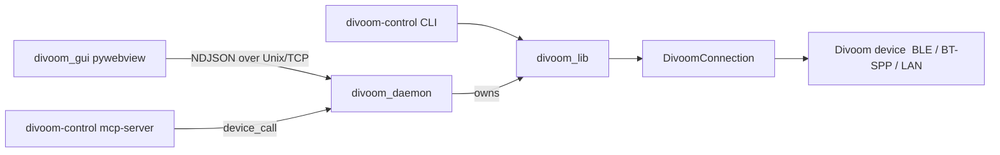

# Divoom Control Architecture

High-level map of `divoom-control` for humans and AI agents. The lower half
(protocols, transports, framing) describes the **library**; this top half
describes the **three-package system** the library now lives inside.

## Three packages (R17)

```
divoom_lib/      pure protocol + transports + encoders + CLI + MCP + weather.
                 The native accelerator (libdivoom_compact.{dylib|so|dll}) and the
                 device bitmap font (divoom_lib/fonts/, R28) live here. No
                 host/OS/GUI deps beyond bleak. Runs on macOS + Linux.
divoom_daemon/   headless, always-on agent: the SINGLE owner of the device
                 connection, a Unix + optional TCP event/command server, and
                 (macOS only) notification monitoring/routing + the menu-bar app.
                 daemon_client.py holds the client plumbing (DaemonClient,
                 DaemonDeviceProxy, ensure_daemon) shared by the GUI + MCP server.
divoom_gui/      pywebview desktop "Control Center" — presentation only. A thin
                 client of the daemon (it owns no BLE connection). macOS today.
                 daemon_bridge.py re-exports divoom_daemon.daemon_client.
```

### Single-owner model (R17 "full cutover")

A BLE connection can be held by exactly **one** process, so the **daemon owns the
device** and the GUI is a thin RPC client:



- The GUI proxies every device call through the daemon's generic `device_call`
  RPC (`DaemonDeviceProxy`); `current_divoom`/`wall_instance` are proxies, not
  real `Divoom` objects. The GUI auto-spawns the daemon if none is running.
- **The MCP server is also a daemon client** (R28): `divoom-control mcp-server`
  builds its tool catalog against a `DaemonDeviceProxy` rather than opening its
  own BLE connection (which would fight the daemon for the single-owner device).
  `--mac` optional; `--host/--port/--token` target a remote daemon.
- **Daemon protocol:** newline-delimited JSON (control plane) over a Unix socket
  (local, trusted) and, optionally, TCP (`--host`/`--port`/`--token`, R19).
  Binary device data (images/GIFs) is shipped via base64 `blobs` only when the
  client is remote; locally, file paths are passed (shared filesystem).
- **Device-bound text** (tickers, sysmon, notifications) is rasterised with the
  crisp 1-bit bitmap font in `divoom_lib/fonts/` (extracted from the Divoom APK,
  R28) — never an anti-aliased TrueType font, which is unreadable at 16/32/64px.
- See `docs/PLANNING_ROUND16.md`/`17`/`19`/`20`/`28` for the daemon, cutover,
  network server, Linux-compat, and MCP-via-daemon/bitmap-font rounds.

### Platform support (R20)

`divoom_lib` + `divoom_daemon` run on **macOS and Linux** (BLE via bleak/BlueZ;
the network server is platform-neutral). The native lib builds per-platform via
`scripts/build_libdivoom.sh` (`.dylib`/`.so`), resolved by
`divoom_lib/native_lib.py`. macOS-only features degrade cleanly on Linux:
notification monitoring → idle/"unsupported", now-playing/cover-art → no-op, the
menu-bar agent is macOS-only.

## Library system overview

The library is a facade supporting multi-transport (BLE, Bluetooth Classic SPP,
and local LAN Wi-Fi HTTP) connection routing.

```mermaid
graph TD
    User[User Script / GUI Bridge] --> Divoom[Divoom Facade (divoom.py)]
    Divoom --> Modules[Sub-modules: light, media, system, tools]
    Divoom --> DivoomConnection[DivoomConnection (connection.py)]
    DivoomConnection --> Bleak[BleakClient (BLE)]
    DivoomConnection --> BTSpp[BTSppTransport (BT Classic SPP/RFCOMM)]
    DivoomConnection --> Lan[LanTransport (LAN HTTP :9000)]
    Bleak --> Device[Physical Divoom Device]
    BTSpp --> Device
    Lan --> Device
```

### Key Components

*   **`divoom_lib/divoom.py` (`Divoom`)**: The main facade orchestrator. It registers all functional submodules and exposes clean, high-level APIs to user scripts and bridge controllers, delegating connection states and command routing to `DivoomConnection`.
*   **`divoom_lib/connection.py` (`DivoomConnection`)**: The central transport controller that manages connection state lifecycles and routes encoded frames over BLE, Bluetooth Classic RFCOMM (`BTSppTransport`), or Wi-Fi (`LanTransport`).
*   **`divoom_lib/bt_spp_transport.py` (`BTSppTransport`)**: Async Bluetooth Classic SPP RFCOMM driver utilizing macOS `IOBluetooth` delegates and dedicated run loops to bypass DriverKit daemon hangs and talk to classic devices (Timoo, Tivoo, Ditoo, etc.).
*   **`divoom_lib/lan_transport.py` (`LanTransport`)**: Local Wi-Fi HTTP client that sends stateless POST JSON commands to Divoom screens (e.g. Pixoo 64) over port `:9000`.
*   **`divoom_lib/framing.py`**: A pure functional library containing stateless helpers for encoding/decoding basic and iOS LE protocol packets, checksum calculation, and payload byte escaping.
*   **`divoom_lib/protocol.py` (`DivoomProtocol`)**: A thin, backward-compatible subclass of `Divoom` kept to prevent breaking old client integrations.
*   **`divoom_lib/models/`**: Configuration models (`DivoomConfig`), constants, and command code schemas.
*   **`divoom_lib/display/`, `divoom_lib/system/`, `divoom_lib/media/`, `divoom_lib/scheduling/`, `divoom_lib/tools/`**: Decoupled domain submodules wrapping raw commands.

## Communication Protocols

Divoom devices use two distinct protocols over BLE, as well as a local HTTP API over Wi-Fi. The library supports all these transports.

### 1. Basic Protocol (Timebox Evo / SPP-like)
Used by older devices or specific modes.
*   **Structure**: `0x01` (Start) + `Length` (2 bytes, LSB) + `Payload` + `Checksum` (2 bytes, LSB) + `0x02` (End).
*   **Payload Escaping**: Certain bytes in the payload (`0x01`, `0x02`, `0x03`) are escaped using `0x03` + `byte + 0x03`.
*   **Responses**: Often framed with `0x04 <CMD> 0x55 ...`.

### 2. iOS LE Protocol
Used by newer devices (Pixoo, Ditoo) for more reliable BLE communication.
*   **Structure**: `HEADER` (4 bytes) + `Length` (2 bytes) + `Command` (1 byte) + `Packet Num` (4 bytes) + `Payload` + `Checksum` (2 bytes).
*   **Header**: `0xfe 0xef 0xaa 0x55` (defined in `models.IOS_LE_MESSAGE_HEADER`).
*   **No Escaping**: The payload is sent raw within the frame.

### 3. Mixed Protocol & Agnostic Parsing
Many modern Divoom BLE firmwares require commands to be written in the **iOS LE Protocol** format, but emit acknowledgements or response payloads in the **Basic Protocol** format. 
*   To resolve this, the library utilizes **Protocol-Agnostic Response Parsing** inside `DivoomConnection._notification_handler()`. It dynamically inspects incoming message headers to correctly unpack Basic or iOS LE response frames on the fly.

### 4. Local Wi-Fi HTTP Protocol (LAN)
WiFi-capable models (e.g. Pixoo 64) expose a stateless REST server over the local network:
*   **Structure**: JSON POST requests on `http://<ip>:9000/divoom_api`.
*   **Fields**: `{"Command": "<action>", "LocalToken": 0, ...}`
*   **Transport Abstraction**: The library uses `divoom_lib/transport.py` to route calls transparently via BLE, LAN, Cloud (remote Divoom server), or External (3rd-party APIs) based on command configurations.

## Architectural Principles (Linus & Uncle Bob)

The system architecture is governed by strict technical guidelines established during our core codebase review:
1.  **Low-Level Data Efficiency (Linus)**: Enforce pure binary buffers (`bytearray` or `bytes`) for parsing and notification handling. Avoid list-backed queues for bytes and hex-to-byte round-trips. Keep hot-path logs lazy to prevent garbage collection churn.
2.  **Event Loop Safety (Linus)**: Disk and file-system I/O (such as cache reads/writes) must never block the asyncio loop; always run blocking operations in worker threads using `asyncio.to_thread`.
3.  **Dependency Inversion (Uncle Bob)**: Decouple high-level modules (e.g. Light, Clock, Sleep) from concrete BLE clients. All sub-modules must depend on the `CommandSender` Protocol interface, allowing standalone unit testing and connection protocol swapping.
4.  **Domain Exceptions (Uncle Bob)**: All Bluetooth, transport, and validation logic should raise domain-specific subclasses (e.g., `DeviceConnectionError`) instead of generic exception strings.

## "Gotchas" & Clarifications for AI Agents

1.  **Inheritance-based Deduplication**: Previously, `DivoomProtocol` and `Divoom` were parallel classes. They have been collapsed; `DivoomProtocol` now inherits directly from the unified `Divoom` orchestrator, with framing and escape routines moved to `divoom_lib/framing.py`.
2.  **Framing Context**: The `_framing_context` manager in `Divoom` dynamically switches between standard basic framing and iOS LE protocols to support multi-device transparent compatibility.
3.  **Notification Handling**: Responses are asynchronous. The client pushes bytes into a `notification_queue`, and requests wait via `asyncio.wait_for(queue.get(), timeout)`.
4.  **Generic ACKs**: A generic acknowledgment `0x33` is automatically parsed and ignored by `wait_for_response` when the device is preparing real data responses.

---

## Strict Architectural Standards

To maintain high maintainability, rapid semantic searches, and easy codebase updates for both human developers and AI agents, the project targets a strict limit:
*   **No File Above 500 Lines of Code (LOC)**: no Python/C/JS/CSS source file in
    `divoom_lib`/`divoom_daemon`/`divoom_gui` exceeds 500 LOC.
*   **Status (2026-06): enforced + clean.** The 2026-06 regression (11 oversized
    files incl. `gui_api.py` 921, `daemon.py` 730) was fully retired via R23
    (gui_api/daemon collaborator splits, cli→cli_commands, constants→
    constants_scheduling, media_sync→audio_visualizer, downsample→downsample_kernel
    + web_ui splits). `tests/test_file_size.py` fails the suite on any new
    >500-LOC file (allow-list now empty).
*   **Agent/Developer Rationale**:
    *   **LLM Context Optimization**: Under 500 LOC ensures an AI assistant can read and reason about the *entire* file without truncation or loss of precision.
    *   **Strict Modularity**: A 500 LOC ceiling forces developers to apply the Single Responsibility Principle, separating framing logic, networking, and data processing.
    *   **Faster Test Runs**: Smaller files encourage discrete unit test files, improving local caching and test execution speed.

---

##  Working with this Codebase: AI Agent Self-Reflections

To make working with the `divoom-control` codebase easier, faster, and more robust, future stages should prioritize the following enhancements:

### 1. Unified Declarative Command Registry
Instead of splitting byte parsing, argument packs, and command codes across `models.py` and display helper files (e.g. VJ effects and Alarm configurations), we should construct a single, **declarative schema registry** (such as JSON or typed Python dataclasses).
*   **Benefits**: Allows AI coding agents to map newly reverse-engineered APK command IDs to byte packing schemas instantly without tracing through duplicate class methods.

### 2. High-Fidelity Loopback BLE Simulation Server
Developing a comprehensive mock client simulation framework (like a loopback socket server or a local Bluetooth mock that responds with authentic Divoom response packets for time, channels, and custom visuals).
*   **Benefits**: Unit tests can run without real hardware, validating entire connection lifecycles, retries, and escaping structures in full loopback speed.

### 3. Modular Decoupling of God Objects
Refactoring the tight bi-directional references between the main `Divoom` entry object and its display sub-modules (e.g., passing a thin, abstract connection proxy delegate to `Light` instead of the whole concrete `Divoom` parent).
*   **Benefits**: Modules can be imported, tested, and upgraded in absolute isolation.

---

## Development Workflow

1.  **Modify Code**: Make changes in `divoom_lib/`.
2.  **Verify**: Run unit tests (`pytest`).
3.  **Mock Test**: Use `scripts/mock_device.py` (if available) to verify protocol logic without hardware.
