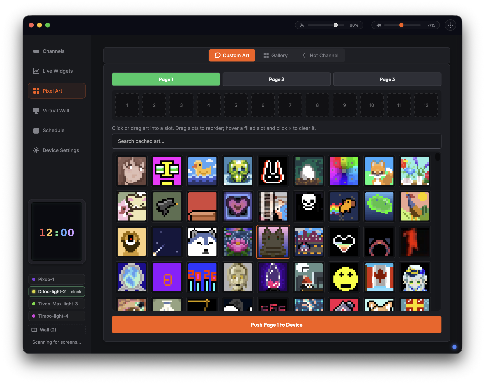

# divoom-control



Control Divoom pixel-display devices (Pixoo / Tivoo / Timebox / Ditoo …) as a
**Python library**, a **headless daemon** (local or over the network), and a
**desktop Control Center app**.

The project has three Python packages, two native **Rust** binaries (the daemon
and the menu-bar agent), and a native accelerator:

1. **`divoom_lib/`** — high-level async library speaking the Divoom BLE protocol
   (plus Bluetooth-Classic SPP and LAN where supported): channels, image/animation
   push, text, clock, brightness, alarms, FM radio, notifications, and more. Runs
   on **macOS and Linux**. Includes the CLI (`divoom-control`) and an MCP server.
2. **`divoomd/`** — the native **Rust** daemon: a headless, always-on agent that
   is the **single owner** of the device connection and serves a command/event
   protocol over a Unix socket and (optionally) TCP. On macOS it also does
   notification monitoring. Runs on **macOS and Linux**. Paired with a **native
   Rust menu-bar agent**, `native-port/divoom-menubar/` — together these are what
   the shipped app runs. `divoom_daemon/` (the Python package) is now client-only:
   the shared NDJSON-socket client library every consumer (GUI, menubar, CLI,
   MCP) uses to talk to whichever daemon is running. The original Python daemon
   *server* implementation was archived to `archive/divoom_daemon/` (2026-07-13)
   once the Rust daemon reached parity — kept for historical reference only, not
   built, run, or tested by anything in this repo.
3. **`divoom_gui/`** — a [pywebview](https://pywebview.flowrl.com/) desktop
   **Control Center** (macOS): live previews, channel grid, live widgets (album
   art / stocks / system monitor), a gallery, a multi-panel "virtual wall", and a
   tools/settings area. It is a **thin client of the daemon** — it owns no BLE
   connection and auto-spawns the daemon if one isn't running.

The **native accelerator** `divoom_lib/libdivoom_compact.{dylib|so}` (palette
encoder, LANCZOS downsampler, frame escaping) is built from
`divoom_lib/native_src/`. Every accelerated path has a pure-Python fallback, and
both are held to the same correctness tests (see *Testing*).

> Unofficial project, not affiliated with Divoom. Use at your own risk.

---

## Features

- **Discovery** — scan for Divoom devices over BLE; manage known LAN devices.
- **Channels** — Clock, Cloud, VJ Effects, EQ/visualizer, Ambient light,
  Scoreboard, Text.
- **Image & animation push** — static images and GIFs, palette-encoded and
  streamed via the 0x8B 3-phase protocol (16px today; 32px encoder included).
- **Live widgets** — auto-push **album cover art** on track change (Spotify /
  Apple Music, macOS), **stock tickers**, and a **system monitor**.
- **Gallery** — browse + sync the Divoom "monthly best" gallery to the device.
- **Virtual wall** — drive a multi-panel grid as one composite display.
- **Tools** — alarms, sleep aid, timer / countdown / noise meter, FM radio,
  anniversary/memorial countdown.
- **Device settings** — brightness, 12/24h, °C/°F, orientation & mirror, name,
  auto-power-off, time sync, weather push, factory reset.
- **Notification mirroring** — trigger the device's notification display (macOS).
- **Headless / networked** — run the daemon on one machine (e.g. a Linux box near
  the device) and control it from another over TCP with a shared token.

---

## Requirements

- **macOS or Linux** for `divoom_lib` + `divoomd` (BLE via `bleak` in Python /
  `btleplug` in Rust — CoreBluetooth on macOS, BlueZ on Linux). The **GUI +
  menu-bar + now-playing sync are macOS-only** today.
- **Python 3.10+** (uses `X | None` type syntax). CI and the shipped app build on
  **Python 3.14**.
- Python deps in `requirements.txt` (`bleak`, `aiohttp`, `pillow`, `pywebview`, …).
- **Rust** (stable, via `rustup`) to build the daemon (`divoomd`) + menu-bar —
  `./build.sh`.
- A C compiler (clang/gcc) is optional — only to build the native accelerator;
  without it everything falls back to pure Python.

## Install

### macOS app (Homebrew)

The packaged Control Center app installs via the [`ztomer/tap`](https://github.com/ztomer/homebrew-tap)
Homebrew tap — no Python setup required:

```bash
brew install --cask ztomer/tap/divoom-control
# later:
brew upgrade --cask ztomer/tap/divoom-control
```

This installs a self-contained `Divoom.app` (GUI + menu-bar agent + bundled
daemon). The first scan prompts once for Bluetooth — grant it. Requires macOS 11
(Big Sur) or later.

### From source (library / daemon / dev)

```bash
pip install -r requirements.txt        # or: pip install -e .
# build the native Rust daemon + menu-bar (+ the C accelerator dylib):
./build.sh
# then run the GUI (it auto-spawns the daemon + menu-bar):
./run.sh
```

`./build.sh --debug` for a debug build; `./run.sh --menubar` runs just the tray
agent for a quick smoke. (Library-only? `bash scripts/build_libdivoom.sh` builds
just the C accelerator — the Python fallback works without it.)

## Run the daemon (headless)

Run the native `divoomd` binary directly (the GUI auto-spawns it for you; this
is only for headless/networked use):

```bash
# local only (Unix socket; the GUI auto-spawns this for you)
./divoomd/target/release/divoomd --socket /tmp/divoom.sock

# headless network server on a LAN, token-authenticated (R19)
./divoomd/target/release/divoomd --host 0.0.0.0 --port 9009 --token "$DIVOOM_DAEMON_TOKEN"
```

Remote clients (including the GUI) target it by setting `DIVOOM_DAEMON_HOST`,
`DIVOOM_DAEMON_PORT`, and `DIVOOM_DAEMON_TOKEN`.

## Run the Control Center (GUI, macOS)

```bash
./run.sh                       # preferred: GUI + native daemon + menu-bar
# or directly:
python3 -m divoom_gui.gui_main
```

> On macOS, BLE access is gated by per-app permission (TCC). The first scan
> prompts for Bluetooth permission; grant it to the launching terminal/app.
> The GUI auto-spawns the daemon, which owns the device connection.

## Use the library

```python
import asyncio
from divoom_lib.divoom import Divoom
from divoom_lib.utils.discovery import discover_device

async def main():
    device, _ = await discover_device()                # scan over BLE
    divoom = Divoom(mac=device.address)
    await divoom.connect()
    try:
        await divoom.display.show_image("art.gif")     # push a static image / GIF
        await divoom.device.set_brightness(80)
        await divoom.notification.show_notification(6) # WhatsApp icon
    finally:
        await divoom.disconnect()

asyncio.run(main())
```

> Note: the library lets you own the device directly. If the daemon is running it
> already holds the connection (single-owner) — stop it first, or talk to it via
> the daemon protocol instead. More runnable scripts are in `examples/`.

---

## Testing

```bash
make test                              # builds the native lib, then the unit suite
python3 -m pytest -q                   # ~1260 tests, no hardware needed
python3 -m pytest -q --run-hardware    # also BLE integration tests (needs a device)
```

The unit suite needs no hardware. `conftest.py` auto-rebuilds the native lib if
it's missing or older than its C sources, so the **encoder correctness suite runs
against both the C and Python implementations** (`test_encoder_both_impls.py`) —
the guard that keeps the two from drifting.

---

## Project layout

```
divoom_lib/            Async BLE/LAN library (macOS + Linux)
  divoom.py              Divoom facade (.display, .device, .system, .alarm, …)
  framing.py             SPP framing/escaping (native-accelerated + Python)
  connection.py          transport + command send/response
  native_lib.py          resolves libdivoom_compact.{dylib|so|dll}
  display/ system/ scheduling/ media/ tools/ utils/   domain submodules
  native/ + native_src/  ctypes wrappers + C sources for encoders/downsampler
  libdivoom_compact.*    built native library (.dylib / .so)
  cli.py                 the `divoom-control` CLI
divoom_daemon/         Daemon CLIENT library (spawn/find/talk to divoomd)
  daemon_client.py        spawn_daemon()/ensure_daemon(), DaemonDeviceProxy
  daemon_protocol.py     NDJSON wire protocol + DaemonClient
  macos_notifications.py notification_router.py   notification plumbing (macOS)
divoomd/               The daemon (Rust): device ownership, command dispatch,
                          Unix/TCP server, macOS notification monitoring
divoom_gui/            Desktop Control Center (pywebview, macOS) — daemon client
  gui_main.py            launcher + Python↔JS bridge; spawns divoomd + divoom-menubar
  daemon_bridge.py       re-exports ensure_daemon()/DaemonDeviceProxy for the GUI
  web_ui/                frontend (app.js, channels.js, widgets.js, …)
native-port/           Other native Rust binaries (bundled in the shipped .app)
  divoom-menubar/        the menu-bar/tray agent (tao + tray-icon)
archive/divoom_daemon/ Archived Python daemon SERVER (superseded by divoomd,
                          2026-07-13) — historical reference only, not built/run
build.sh / run.sh      build the Rust binaries / run the GUI (+ daemon + menubar)
scripts/build_libdivoom.sh   cross-platform native (C accelerator) build
scripts/build_release.sh     build the shippable Divoom.app + dmg (py2app)
docs/                  ARCHITECTURE, REVIEW, planning rounds, SESSION_HANDOFF
tests/                 pytest suite
```

## Contributing / working notes

This repo is worked by multiple agents and sessions sharing one git tree. See
**`AGENTS.md`** for conventions, **`docs/SESSION_HANDOFF.md`** for current state +
open threads, **`ARCHITECTURE.md`** for the system map, and
**`docs/REVIEW_2026-06.md`** for the latest code/UX/architecture review. Keep
tests green and update the handoff each round.
